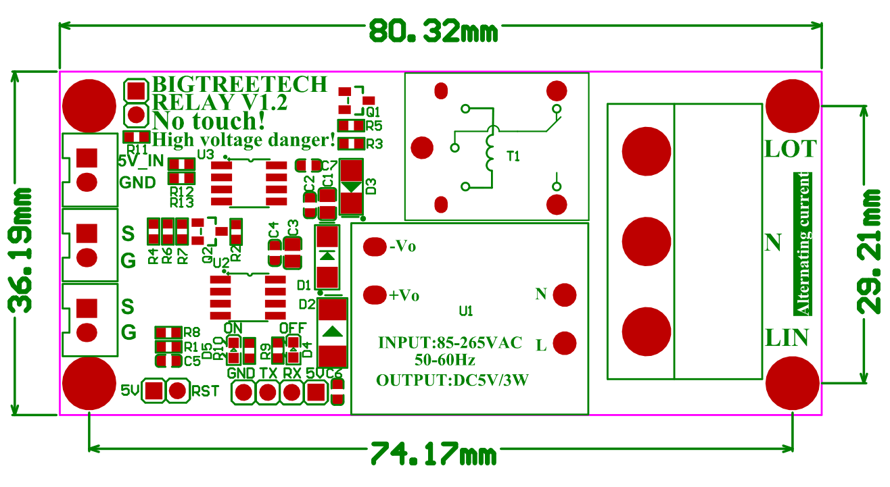
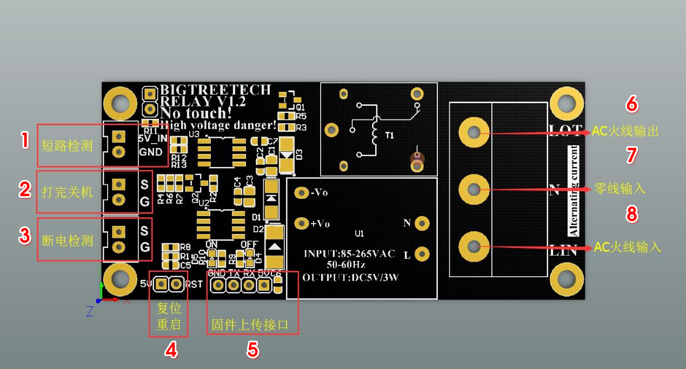
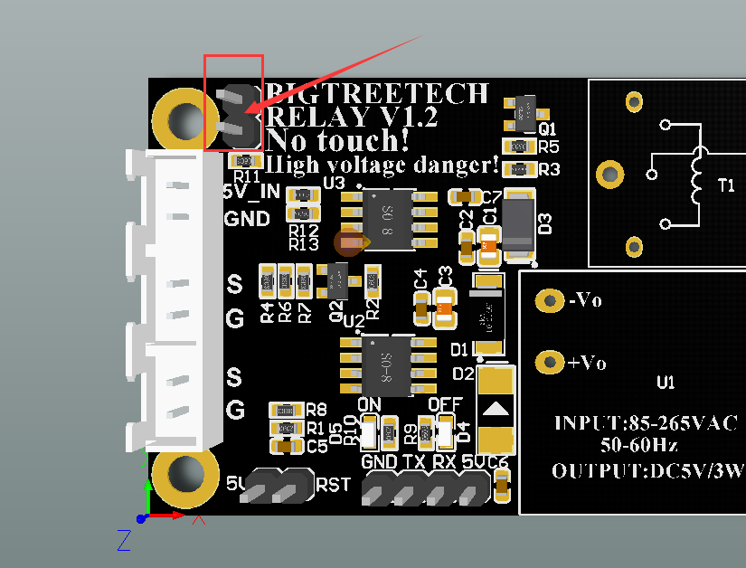
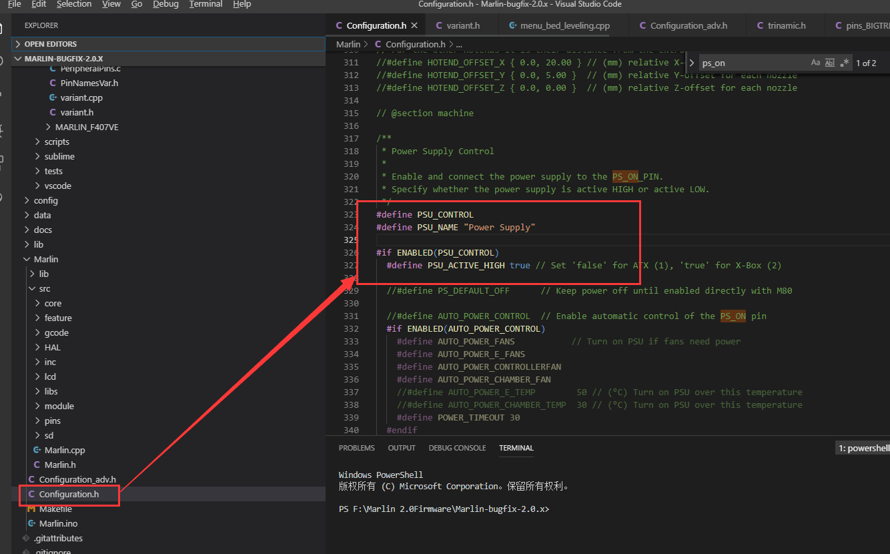
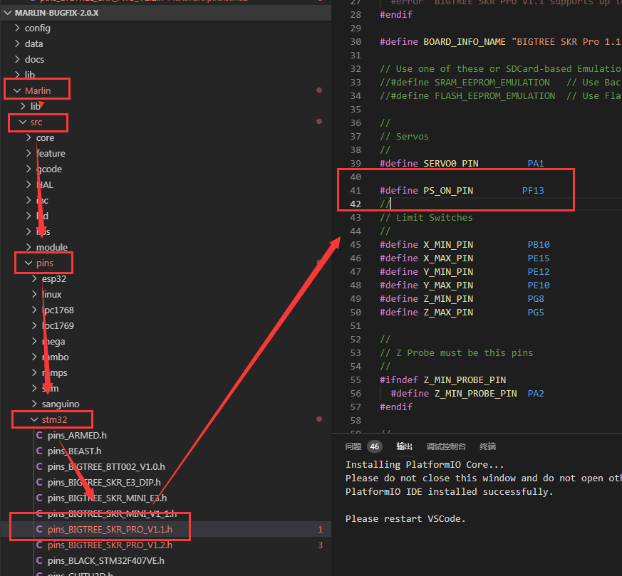
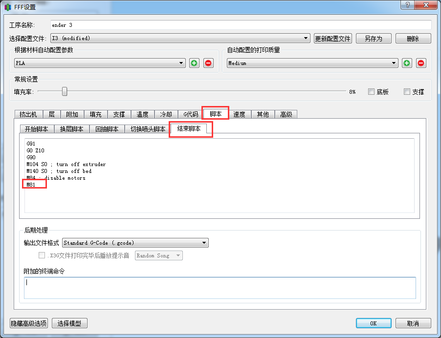

# BIGTREETECH Relay V1.2
[Relay V1.2-Operating Instruction.pdf](https://github.com/bigtreetech/BIGTREETECH-Relay-V1.2/blob/master/BIGTREETECH%20Relay%20V1.2/BIGTREETECH%20Relay%20V1.2/Relay%20V1.2-Operating%20Instruction.pdf)

## Инструкция по использованию

### I . Знакомство с продуктом
Реле BIGTREETECH V1. 2 является обновлением оригинального (BIGTREETECH V1.0). После обновления на модуль был добавлен небольшой микроконтроллер, чтобы сделать его более управляемым и стабильным. Кроме того, мы также улучшили схему обнаружения короткого замыкания. После подключения 5В и GND материнской платы к модулю, в случае наличия короткого замыкания на 5В, модуль сразу же выключается, чтобы предотвратить риск возгорания и повреждение материнской платы, вызванный коротким замыканием.

Модуль автоматически отключает питание после печати, что является очень энергосберегающим и экологичным. Это также снижает риск того, что принтер останется включенным после печати.

### II. Параметры продукта
1. Входное напряжение переменного тока: 85V/AC - 265V/AC
2. Входное логическое напряжение: 3,3 - 5 В
3. Поддержка возобновления печати при выключенном питании
4. Поддержка  обнаружения перебоев в подаче питания
5. Поддержка обнаружения короткого замыкания
6. Программируемый

### III. чертёж с размерами


### IV. Схема подключения

1. Обнаружение короткого замыкания (短 路 检 测)
2. Завершение работы после окончания (打 完 关 机)
3. Обнаружение перебоев в электропитании (断 电 检 测)
4. Перезагрузка (复 位 重 启)
5. Порт для загрузки прошивки (固 件 上 传 接 口)
6. Выход линии сети переменного тока (AC 火 线 输 出)
7. Вход нулевой линии(零 线 输 入)
8. Вход линии сети переменного тока (AC 火 线 输 入)

**Инструкции по функции обнаружения короткого замыкания:**

При использовании функции обнаружения короткого замыкания необходимо соединить два контакта перемычкой (как показано на рисунке ниже). Если Вы не хотите использовать функцию обнаружения короткого замыкания, снимите перемычку



### V. Описание функций
- P3.2 контакт определения сигнала выключения.
- P5.5 контакт реле управления
- P3.3 контакт цепи обнаружения короткого замыкания 
- P5.4 контакт сброса и перезапуска
- P3.0 и P3.1 контакты для загрузки прошивки

### VI. Способ модификации прошивки
1. Откройте файл Configuration.h в прошивке и найдите:
    ``` cpp
    //#define PSU_CONTROL
    //#define PSU_NAME "Power Supply"
    
    #if ENABLED(PSU_CONTROL)
      #define PSU_ACTIVE_HIGH false     // Set 'false' for ATX, 'true' for X-Box
    ```
    Раскомментируйте код приведенный выше "//", как показано на рисунке:
    
    
2. Возьмем SKR-PRO-V1.1 в качестве примера, откроем файл pins_BIGTREE_SKR_PRO_V1.1.h в указанном на рисунке порядке, затем найдем в файле код "#define PS_ON_PIN PF13" и раскомментируйте его "//". PF13 - это пин сигнала выключения, который может быть изменен в соответствии с Вашими собственными потребностями, как показано на рисунке (если его нет, то необходимо дописать):
   
    
3.	Для модификации ПО для нарезки, возьмите в качестве примера "Simplify3D", откройте слайсер Simplify3D, а затем откройте интерфейс настройки печати, добавьте команду "M81" в конце финального скрипта, как показано на рисунке ниже
    
    
    
### VII. Примечания

1.	Процесс подключения должен выполняться при выключенном питания.
2.	При подключении, пожалуйста, обратите внимание на табличку на модуле и схему подключения в инструкции. Только тогда, когда провод правильно подключен, он может находиться под напряжением.
3.	Нижняя часть модуля реле V1.2 должна быть расположена на удалении от воды, металла и других проводников для предотвращения короткого замыкания и поражения электрическим током, которые могут вызвать аварии
4.	Не прикасайтесь к проводам и модулю реле V1.2 во избежание поражения электрическим током.
5.	Не забудьте об изоляции при использовании для предотвращения поражения электрическим током.
6.	При подключении проводов необходимо обеспечить их достаточное прижание, чтобы избежать плохого контакта.
7.	Входное напряжение питания от сети AC: 125V/AC-250V/AC 50-60Hz
8.	Наша компания не будет нести ответственность за любой несчастный случай, вызванный несоблюдением инструкций или чертежей.
